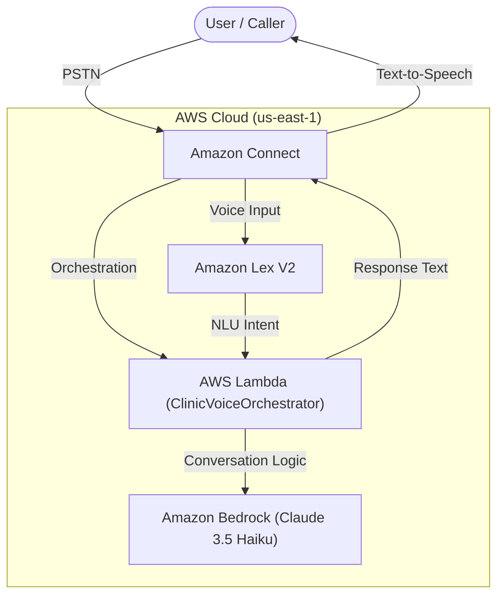

# Clinic Voice Agent - Deployment & Setup Guide

This guide provides instructions for deploying the Melbourne Medical Clinic Voice Agent, an AI-powered call center solution using Amazon Connect, Amazon Lex V2, AWS Lambda, and Amazon Bedrock.

## High-Level Architecture

The system architecture features a serverless, event-driven design:



**Components:**
1.  **Amazon Connect**: Handles telephony, contact flows, and voice interaction.
2.  **Amazon Lex V2**: Provides Automatic Speech Recognition (ASR) and Natural Language Understanding (NLU) to capture user intent.
3.  **AWS Lambda (`ClinicVoiceOrchestrator`)**: Node.js function that manages conversation state and integrates with Bedrock.
4.  **Amazon Bedrock**: Generates natural, context-aware responses using the Claude 3.5 Haiku model.

---

## Prerequisites

Before deploying, ensure you have the following:

1.  **AWS Account**: With Administrator access or sufficient permissions for Connect, Lex, Lambda, IAM, and Bedrock.
2.  **AWS CLI**: Installed and configured (`aws configure`).
3.  **Node.js**: Version 18.x or later installed.
4.  **Python**: Version 3.x installed (for flow generation).
5.  **PowerShell**: For running deployment scripts.
6.  **Amazon Bedrock Access**: Ensure `Anthropic Claude 3.5 Haiku` model access is enabled in `us-east-1`.

---

## Deployment Steps

All scripts are located in the `infra/` directory. Run commands from the project root.

### 1. Setup IAM Roles
Create the necessary IAM roles for Lambda and Lex.

```powershell
# Create Lambda Role
./infra/setup_iam.ps1

# Create Lex Service Role
./infra/setup_lex_iam.ps1
```

### 2. Deploy Lambda Function
Package and deploy the orchestrator function.

```powershell
./infra/deploy_lambda.ps1
```
*Note: This script installs `orchestrator` dependencies, zips the code, and updates/creates the Lambda function.*

### 3. Configure Amazon Lex Bot
Create the `ClinicListener` bot with Australian English (`en_AU`) locale.

```powershell
./infra/create_lex_bot.ps1
```

> **IMPORTANT MANUAL STEP**:
> The CLI script creates the Bot and Intent but may fail to create the `UserQuery` slot due to complexity. You must verify/finish this in the AWS Console:
> 1.  Go to **Amazon Lex** -> **ClinicListener** -> **Intents** -> **CatchAll**.
> 2.  Ensure a slot named `UserQuery` exists (Type: `AMAZON.FreeFormInput`, Prompt: "What can I help you with?").
> 3.  **Build** the bot.
> 4.  Create a **Bot Version** and map it to an **Alias** named `Prod`.
> 5.  Copy the **Alias ARN**.

### 4. generates Contact Flow
Generate the Amazon Connect Contact Flow JSON. This script dynamically fetches your resource ARNs.

```powershell
# Dependencies: boto3 (optional, script falls back to AWS CLI)
python generate_flow.py > flow_v4_au.json
```

> **Manual Update**: If the script warns about missing Aliases, open `flow_v4_au.json` and replace `arn:aws:lex:us-east-1:ACCOUNT_ID:bot-alias/BOT_ID/ALIAS_ID` with the real **Alias ARN** from Step 3.

### 5. Configure Amazon Connect
1.  **Create Instance**: If you don't have one, create an Amazon Connect instance in `us-east-1`.
2.  **Claim Phone Number**: Claim a DID or Toll-Free number in the Connect dashboard.
3.  **Import Flow**:
    - Go to **Routing** -> **Contact Flows**.
    - Click **Create contact flow**.
    - Select **Import Flow (beta)** and upload `flow_v4_au.json`.
    - **Publish** the flow.
4.  **Associate Number**: Point your claimed phone number to this new Contact Flow.

---

## Configuration

### Orchestrator Config (`orchestrator/config.mjs`)
Customize the clinic details, greeting messages, and doctor availability in this file.

```javascript
export const CLINIC_CONFIG = {
    name: "Melbourne Medical Clinic",
    timezone: "Australia/Melbourne",
    // ...
};
```

### Region Configuration
- **Lambda & Bedrock**: Defaults to `us-east-1` (hardcoded in `index.mjs` and deployment scripts).
- **Lex**: Defaults to `en_AU` locale (in `create_lex_bot.ps1`).

---

## Troubleshooting

- **Lambda Errors**: Check CloudWatch Logs for `ClinicVoiceOrchestrator`.
- **Lex Recognition Issues**: Ensure the `CatchAll` intent has the `UserQuery` slot configured as "Required".
- **Access Denied (iam:PassRole)**: 
    If you see `User ... is not authorized to perform: null` or `iam:PassRole`, your user needs additional permissions.
    Run this command to attach a fix policy to your user (replace `YOUR_USERNAME`):
    ```powershell
    aws iam put-user-policy --user-name YOUR_USERNAME --policy-name ClinicAdminFix --policy-document file://infra/admin-policy-fix.json
    ```
